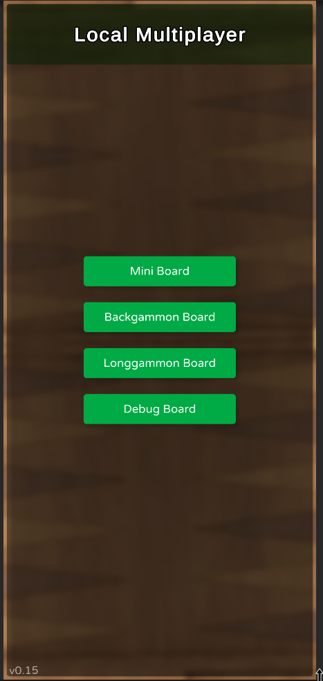
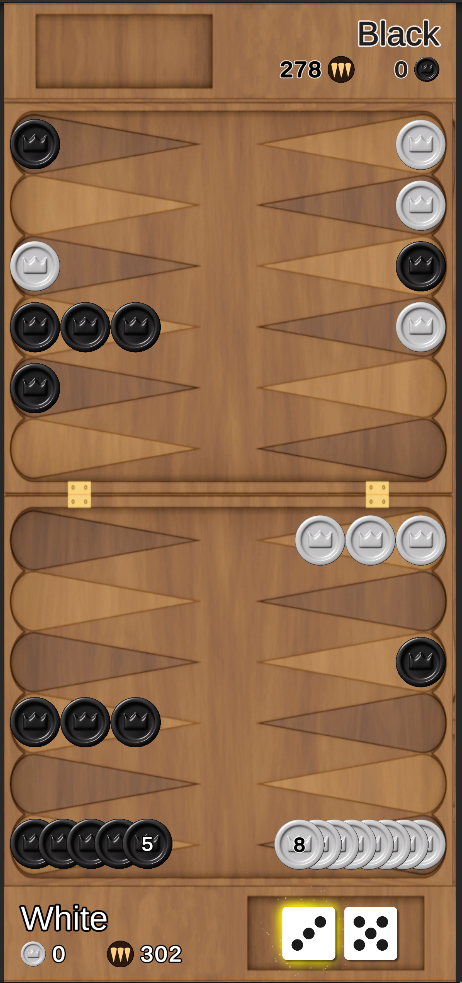
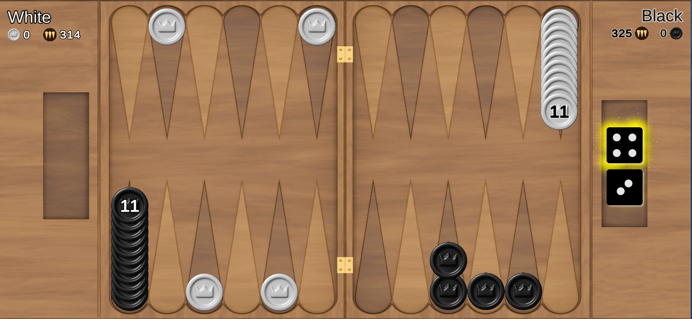

# Narde
A Unity game based on Narde (also known as LongGammon).  
Project source code is private, linked [here](https://github.com/liormushiev/Narde)
*Game Built with Unity 2022.3.5f1*  
*Testing Built with C#.NET 7.0.100*

# Screenshots

# Project Links
* [Game Website](http://68.83.165.13/)
* [Milestone Doc](https://docs.google.com/document/d/1QsN3H6nxUg2RyeJ_d9EB5k77-_HzqkEG5xhDLJxVby0/edit)
* [Build Downloads](https://mega.nz/folder/CnwDwBjI#SF0jby2EEahtnFUuaMESCQ)
* [Engineering Diagram](https://docs.google.com/drawings/d/1XKhVOKV4r8eMdTmyru82MZEdI8S1OKcl39__Qt35Bs8/edit)
* [Google Drive Folder](https://drive.google.com/drive/folders/1Ji-6azgWV9c_3WJ3ikLHN3F4lF7Slq1e)
* [Github Repository](https://github.com/liormushiev/Narde)
* [Gitlab Repository](https://gitlab.com/RoseMaster3000/narde)

# Reference
* [LeanTween Docs](http://dentedpixel.com/LeanTweenDocumentation/classes/LeanTween.html)
* [Unity Scripting Reference](https://docs.unity3d.com/ScriptReference/index.html)
* [Animation Easings](https://easings.net/en)
* [TextMeshPro](http://digitalnativestudios.com/textmeshpro/docs/ScriptReference/TextMeshPro.html)
* [Unity Assets](https://assetstore.unity.com/users/18967446466281/saveForLater)
* [BestHTTP Socket.io](https://besthttp-documentation.readthedocs.io/en/dev/3.1Socket.IO3/)
* [BestHTTP Socket.io](https://benedicht.github.io/BestHTTP-Documentation/pages/best_http2/protocols/socketio/socketio.html)

# Multiplayer
For running multiple instances of game:
1. Download unitypackage [ParrelSync](https://github.com/VeriorPies/ParrelSync/releases)
2. Assets > Import Package > ParrelSync.unitypackage
3. [ParrelSync API](https://github.com/VeriorPies/ParrelSync/wiki/List-of-APIs)
4. ParrelSync > Clone Manager > Create Clone | Open In New Editor

# Dedicated Server
This game depends uses [BestHTTP](https://benedicht.github.io/BestHTTP-Documentation/pages/best_http2/protocols/socketio/socketio.html) to connect to a [Socket.io](https://benedicht.github.io/BestHTTP-Documentation/index.html) dedicated [server](https://github.com/RoseMaster3000/Narde-Server). Be sure to properly configure the server address of the [`NetworkManager`](https://github.com/liormushiev/Narde/blob/main/Assets/Scripts/Networking/NetworkManager.cs) component in Unity as well.

# Downloads
* [C#.NET](https://dotnet.microsoft.com/en-us/download)
* [Unity](https://unity.com/download)
